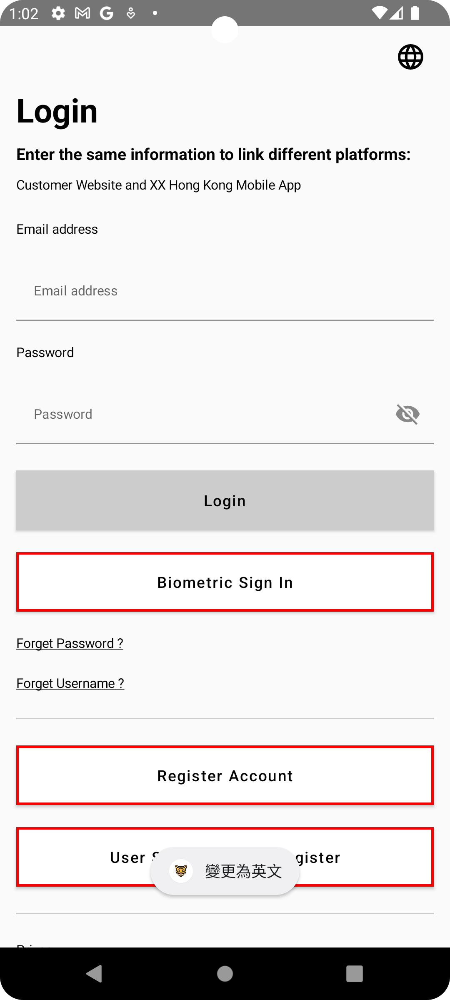
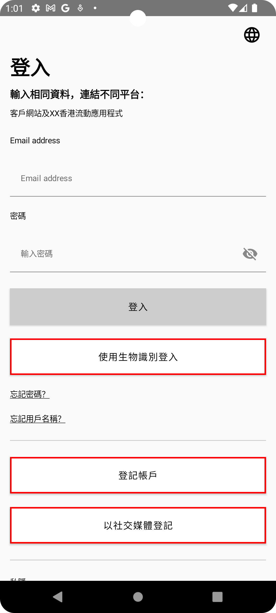
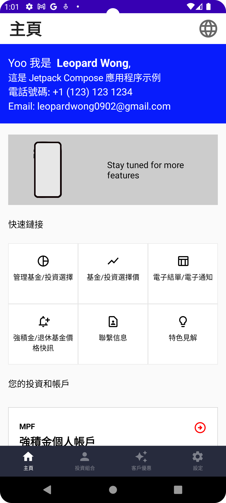

# Jetpack Compose and Coroutines Example Project

Welcome to the Jetpack Compose and Coroutines Example Project! This repository is a collection of sample code that demonstrates the usage of Jetpack Compose, a modern toolkit for building native Android UI, in combination with Coroutines for handling asynchronous tasks.

## Project Overview
Jetpack Compose revolutionizes Android UI development by providing a declarative and modern approach to building user interfaces. Coroutines, on the other hand, offer a way to manage asynchronous operations efficiently. This project aims to showcase the seamless integration of these technologies in building robust and responsive Android applications.

## Screenshots

Here are some screenshots of the app in action:

### English Version:

  <!-- Adjust the width attribute as needed to control the size -->
  
  

### Traditional Chinese Version:

  <!-- Adjust the width attribute as needed to control the size -->
  
  

## Getting Started

To explore the examples in this project, follow these steps:

1. Clone the repository or download the source code as a ZIP file.
2. Open the project in Android Studio.
3. Run the examples on an emulator or a physical device.

## Examples

The project includes examples of using Jetpack Compose and Coroutines together, including:

- [Text](https://developer.android.com/jetpack/compose/text): Utilize the Text component to display textual content.
- [Buttons](https://www.jetpackcompose.net/buttons-in-jetpack-compose): Learn how to create interactive UI elements using Buttons.
- [Lists](https://developer.android.com/jetpack/compose/lists): Explore the power of Lists in building dynamic and scrollable interfaces.
- [Navigation](https://developer.android.com/jetpack/compose/navigation): Implement basic navigation using Navigation components.
- [Coroutines](https://developer.android.com/kotlin/coroutines?gclid=Cj0KCQjwtamlBhD3ARIsAARoaExuplpiIo3pZO5XXUJBL99ZYrYuBvVdzL1HzaHw6rB7eUVZznBwYqEaAs8SEALw_wcB&gclsrc=aw.ds): Understand how to integrate Coroutines for managing asynchronous tasks effectively

## TODO
Here are the upcoming enhancements planned for the project:

#### Code Style Refactor:
Improve code structure and formatting for better maintainability.
#### Implement Biometrics and Social Media Sign In:
Integrate biometric authentication and social media sign-in features.

## License
